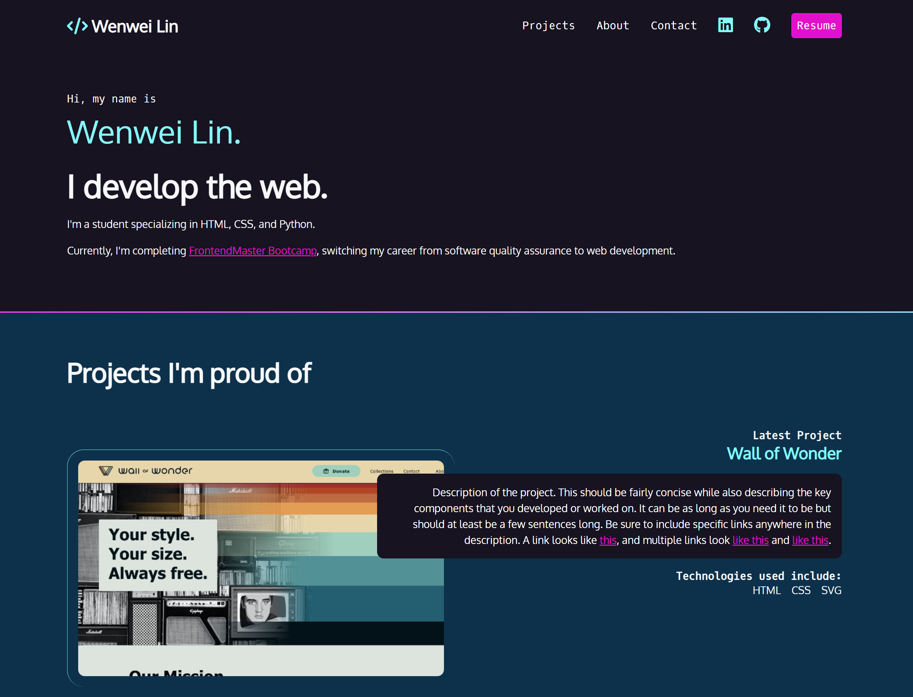

# Build a fully responsive portfolio website with only HTML and CSS

Course link: [Getting Started with CSS](https://frontendmasters.com/courses/getting-started-css/)
Preview link: [Wenwei Lin's Portfolio Website](https://wenwei-lin.github.io/learn-frontend/02-portfolio/)

### Takeaways

- Semantic HTML
- Mobile First Design
- Responsive Design
- CSS Flexbox
- CSS Grid (for overlapping)
- ...

### Overview:

